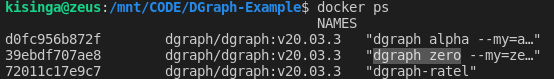

# dgraph-example

This is a simple repository that demonstrates DGraph usage in golang
The main structure was generated using [Goxygen](https://github.com/shpota/goxygen)
Queries an dgeneral db functionality was improved using
[dgman (DGraph Schema Manager)](https://github.com/dolan-in/dgman)
As much as my natural intuition was to stay away from 3rd party libs as much as possible,
this functionlity provides features that are so core that
I feel need for them to be re enforced.

## Environment setup

You need to have [Go](https://golang.org/),
[Node.js](https://nodejs.org/),
[Docker](https://www.docker.com/), and
[Docker Compose](https://docs.docker.com/compose/)
(comes pre-installed with Docker on Mac and Windows)
installed on your computer.

Verify the tools by running the following commands:

```sh
go version
npm --version
docker --version
docker-compose --version
```

If you are using Windows you will also need
[gcc](https://gcc.gnu.org/). It comes installed
on Mac and almost all Linux distributions.

## Configure database

The default docker container runs in a self-sufficicent enviroment.
If you intend your databse to run in and independent environment
outside this docker container, modify the following files:

1. docker-compose.yml comment out the code that adds dgraph to
   the current environment and bundles it with the app
2. config.yml hold the dgraph config url. Modify the url
   according to your specific setup

## Start in development mode

In this configuration you have a total of 3 different
apps running in different ports

1. The dgraph server (zero, ratel, dgraph server are all bundled
   and being counted as one)
2. The golang backend, acting as the API endpoint
3. The Angular frontend, making requests to the API endpoint

In the project directory run the command (you might
need to prepend it with `sudo` depending on your setup):

```sh
docker-compose -f docker-compose-dev.yml up
```

This starts a local DGraph instance on `http://localhost:8080`.

Navigate to the `server` folder and start the back end:

```sh
cd server
go run server.go
```

The back end will serve on http://localhost:3000.

Navigate to the `webapp` folder, install dependencies,
and start the front end development server by running:

```sh
cd webapp
npm install
npm start
```

The application will be available on http://localhost:3030.

## Start in production mode

In the project directory run the command (you might
need to prepend it with `sudo` depending on your setup):

Perform:

```sh
docker-compose up
```

This will build the application and start it together with
its database. Access the application on http://localhost:3000.

It also starts a local DGraph instance on http://localhost:8080`.
The database will not be populated with test records.
Production mode does not expose ratel

## My app shows no data

Glad you made it this far. You need to initialise the db with somne sample data
With the server already running (can be either prod or dev),
open http://localhost:8000/?latest and navigate to the schema --> Bulk Edit
paste the contents from [this file](sample/init.txt) click "Aplly schema"

Open terminal and execute the following command

```sh
docker ps
```

This will give you a list of docker containers running. Note the
id assigned to `dgraph zero`
In the attached screenshot it's `39ebdf707ae8`

Run the command

```sh
docker exec -it <container_Id> dgraph live -f /1million.rdf.gz --alpha alpha:9080 --zero zero:5080 -c 1
```

replacing `<container Id>` with the id attained above
There’s around one million triples in the dataset. Dgraph reports
back exactly how many triples were loaded and how long it took.

It’s a big database of movies, but it won’t trouble Dgraph. It is,
however, big enough for us to use more complex queries.
The dataset is downloaded from the [official docs](https://github.com/dgraph-io/tutorial/blob/master/resources/1million.rdf.gz)

## Testing DGraph using Ratel (Dev Mode Only)

Navigate to http://localhost:8000/?latest on your browser
paste [this query](/sample/query.graphql)
You sould get a response similar to 
Congratulations!!
You've successfully run a dockerised dgraph and loaded it with millions of datasets

## Ingesting the data

## Development

This setup can easily be modified to separate frontend from
the backend.
Modify the [environment variable](webapp/src/environments/environment.ts)
and replace "apiUrl" with desired value

## Disclaimer

I know I should be writing tests. This is still a WIP
